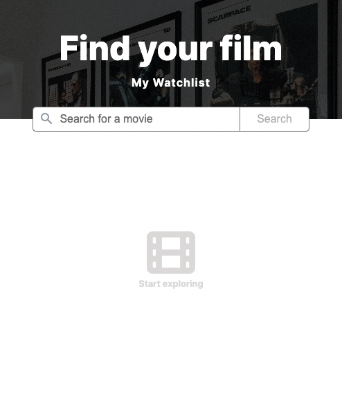
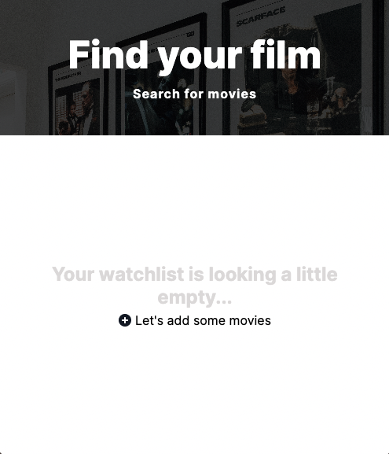

# Movie Watchlist

A solo project from the [Scrimba Frontend Developer Career Path](https://scrimba.com/learn/frontend)

## Table of Contents

- [Overview](#overview)
  - [Requirements](#requirements)
  - [Screenshots](#screenshots)
  - [Links](#links)
  - [Built with](#built-with)
- [Future Goals](#future-goals)

## Overview

### Requirements

- [x] Two pages - index.html and watchlist.html
- [x] Index = search page. Call to OMDB API with the title searched for and displays search results
- [x] Button to "add to watchlist" which saves that data to local storage
- [x] Watchlist.html loads and displays data from local storage

### Screenshots

#### Search Movies (Mobile)

#### Watchlist (Mobile)

### Links

- Live Site URL: [GitHub Pages](https://xchristinawu.github.io/movie-watchlist/)

### Built with

- HTML, CSS, JavaScript
- [OMDb API](https://www.omdbapi.com/)
- Mobile First Design

## Future Goals
- Dark mode option

